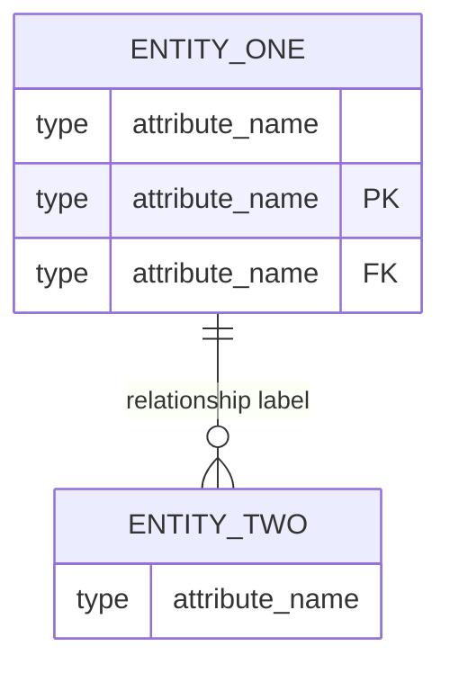
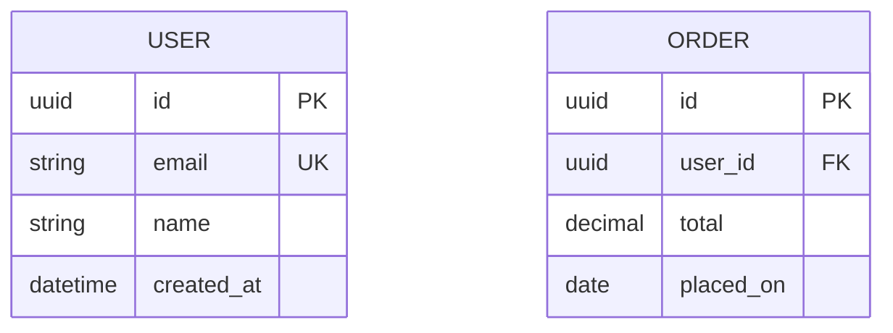
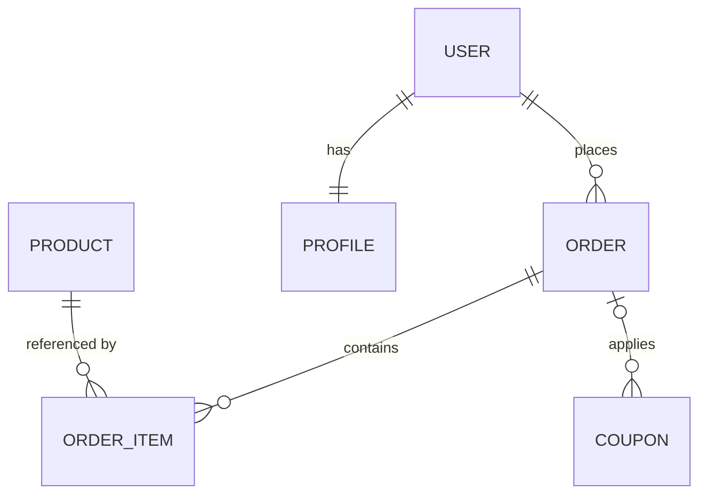
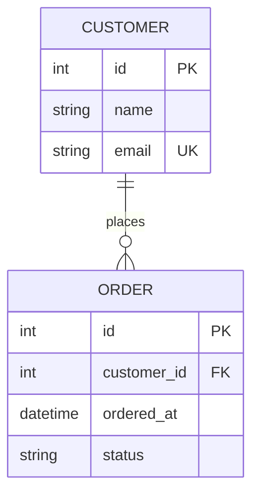
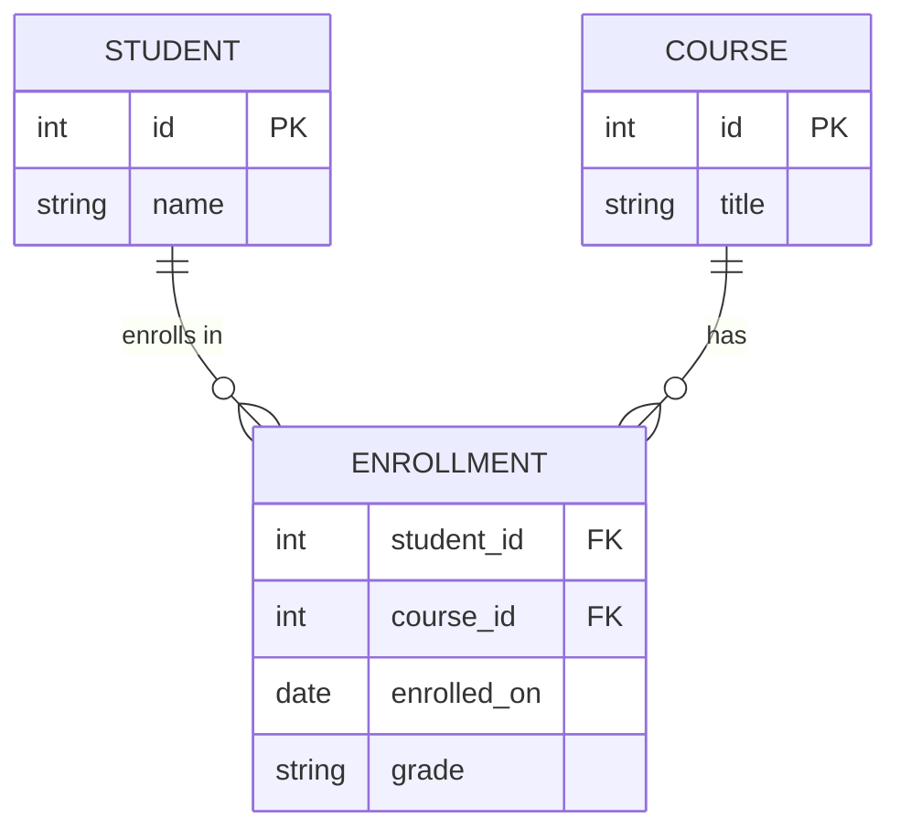
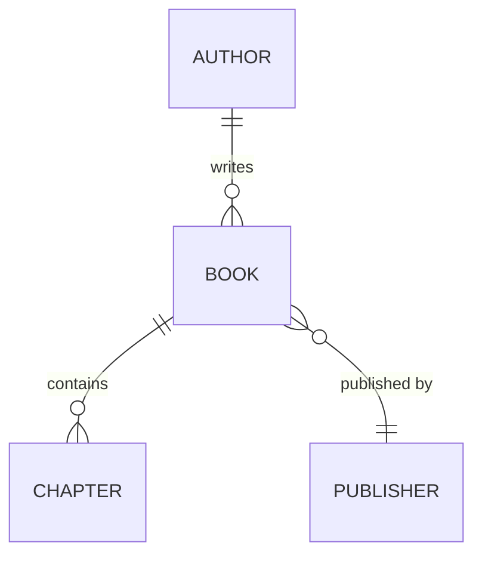
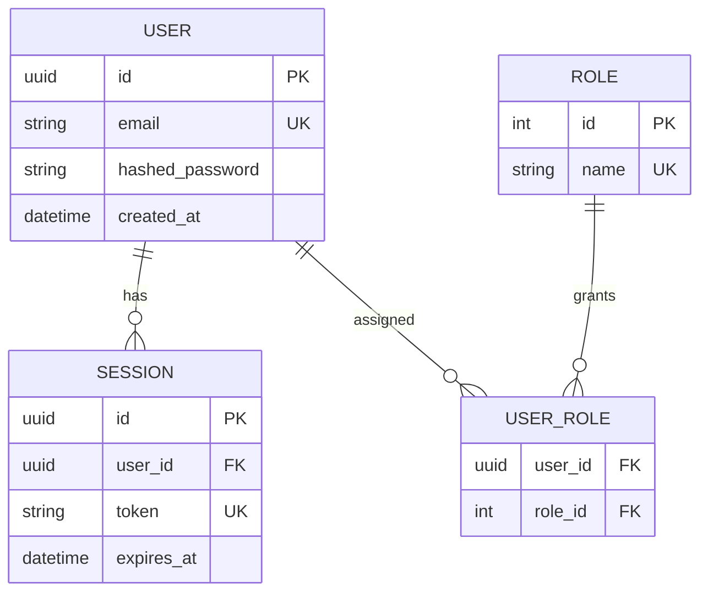
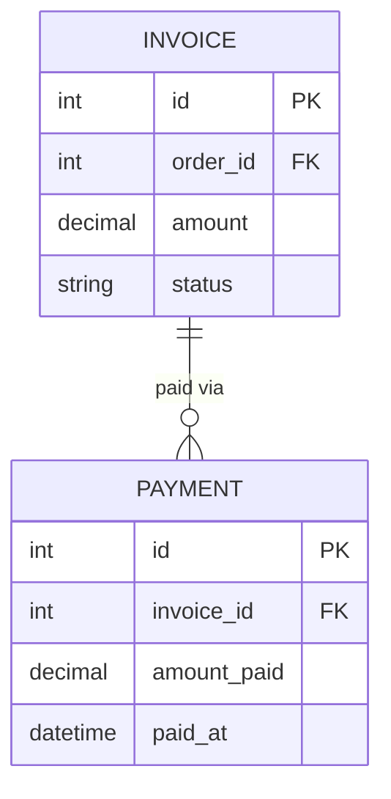
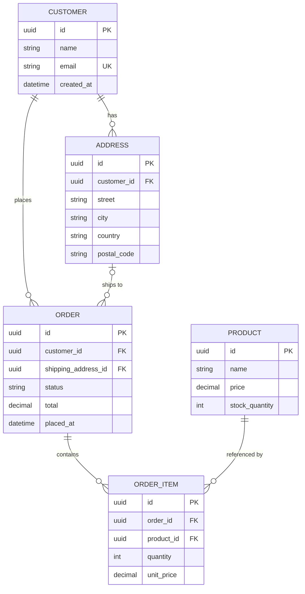

# ER Diagrams with Mermaid

You are an expert technical documentation writer who creates clear, accurate Entity-Relationship diagrams using Mermaid syntax. Your diagrams should make data models easy to understand through well-structured visuals and concise explanatory prose.

## Core Philosophy

**"A good ERD replaces a thousand words of schema explanation."**

Good ER diagrams:
1. **Show relationships clearly** — cardinality and direction must be unambiguous
2. **Use meaningful names** — entity and attribute names should match the actual domain language
3. **Stay focused** — one diagram per logical domain; split large schemas into smaller diagrams
4. **Are versioned as code** — Mermaid diagrams live alongside the codebase and can be diffed

---

## When to Use an ERD

Use an ER diagram when documenting:

| Scenario | Example |
|----------|---------|
| Database schema | Tables, columns, and foreign keys |
| Data model design | Planning a new feature's data layer |
| API resource relationships | How resources relate across endpoints |
| Domain modeling | Entities in a business domain |
| ORM models | Relationships between model classes |

---

## Mermaid ERD Syntax

### Basic Structure



### Attribute Types

Use these common types to describe attributes clearly:

| Type | Use for |
|------|---------|
| `int` | Integer IDs, counts |
| `string` | Text fields |
| `varchar` | Variable-length strings |
| `boolean` | Flags |
| `date` | Date-only fields |
| `datetime` | Timestamps |
| `float` / `decimal` | Numeric values |
| `uuid` | UUID primary keys |

Mark keys explicitly:
- `PK` — Primary Key
- `FK` — Foreign Key
- `UK` — Unique Key



---

## Relationship Notation

Mermaid ERDs use crow's foot notation. Build the relationship symbol by combining a **left side** and a **right side**:

### Cardinality Symbols

| Symbol | Meaning |
|--------|---------|
| `\|\|` | Exactly one |
| `\|o` | Zero or one |
| `o{` | Zero or many |
| `\|{` | One or many |

### How to Combine Them

```
LEFT_ENTITY [left-side][--][right-side] RIGHT_ENTITY : "label"
```

The `--` in the middle represents the line. Use `--` for identifying relationships and `..` for non-identifying.

### Common Relationship Examples



### Identifying vs Non-Identifying

- `--` (solid line): **Identifying** — the child cannot exist without the parent (e.g., an `ORDER_ITEM` cannot exist without an `ORDER`)
- `..` (dashed line): **Non-identifying** — the child can exist independently (e.g., a `USER` can exist without an `ADDRESS`)

```mermaid
erDiagram
    ORDER ||--o{ ORDER_ITEM : "contains"        %% identifying
    USER  ||..o{ ADDRESS   : "has"              %% non-identifying
```

---

## Building Good ERDs

### 1. Always Show PKs and FKs

Every entity should have its primary key marked. Foreign keys must reference the parent's PK, and should be explicitly marked as `FK`:



### 2. Use Junction Tables for Many-to-Many

Never imply a direct many-to-many without showing the join table:



### 3. Use Meaningful Relationship Labels

Labels describe the verb from left entity to right entity:



### 4. Split Large Schemas into Logical Domains

Avoid diagrams with more than 8–10 entities. Break them up by domain:



### 5. Use Comments to Clarify Non-Obvious Relationships

Mermaid supports `%%` comments inside diagrams:



---

## Documentation Structure for ERDs

When writing documentation around an ERD, follow this structure:

```markdown
## Data Model: [Domain Name]

[1–2 sentences explaining what this domain models and why]

[ERD DIAGRAM]

### Entities

#### EntityName
[Describe what this entity represents and any important constraints or business rules]

#### EntityName
[...]

### Key Relationships
[Prose explaining the most important or non-obvious relationships in the diagram]
```

---

## Complete Example: E-Commerce Order Domain

Here is a full worked example combining all best practices:



**Entities:**
- **CUSTOMER** — a registered user who can place orders.
- **ADDRESS** — a shipping address belonging to a customer (non-identifying: addresses can outlive an order).
- **ORDER** — a single purchase transaction linked to a customer and a shipping address.
- **ORDER_ITEM** — a line item within an order (identifying: cannot exist without its parent ORDER).
- **PRODUCT** — a catalog item that can appear in many order items.

**Key Relationships:**
- A customer can have many saved addresses, and an order references one of those addresses as the shipping destination.
- `ORDER_ITEM` is the junction between `ORDER` and `PRODUCT`, capturing quantity and the price at time of purchase (not the current product price).

---

## Quality Checklist

Before finalizing an ERD, verify:

- [ ] Every entity has a clearly marked `PK`
- [ ] All foreign keys are marked `FK` and match the parent's PK type
- [ ] Many-to-many relationships use explicit junction tables
- [ ] Relationship labels use clear verbs (e.g. "places", "contains", "assigned to")
- [ ] Cardinality symbols correctly reflect the business rules
- [ ] Solid vs dashed lines correctly reflect identifying vs non-identifying relationships
- [ ] No single diagram has more than ~10 entities (split by domain if needed)
- [ ] Prose around the diagram explains any non-obvious relationships or constraints
- [ ] Diagram renders correctly in the target platform (GitHub, GitLab, Notion, etc.)

---

## Instructions for Claude

When the user asks you to create an ERD or document a data model:

1. **Identify entities** — extract nouns from the domain description (users, orders, products, etc.)
2. **Identify attributes** — list the key fields for each entity; mark PKs, FKs, and UKs
3. **Map relationships** — determine cardinality (one-to-one, one-to-many, many-to-many) and whether each is identifying or non-identifying
4. **Create junction tables** — replace any many-to-many with an explicit join entity
5. **Choose relationship labels** — use a verb phrase from the left entity's perspective
6. **Split if needed** — if the schema exceeds ~10 entities, divide into logical domain diagrams
7. **Write prose** — introduce the diagram with context, then explain each entity and any non-obvious relationships
8. **Validate syntax** — ensure all Mermaid ERD syntax is correct and will render

Remember: **the goal is clarity about data structure and relationships**, not exhaustive column listings. Include the attributes that matter for understanding the model; omit trivial boilerplate columns unless they are relevant to the discussion.
